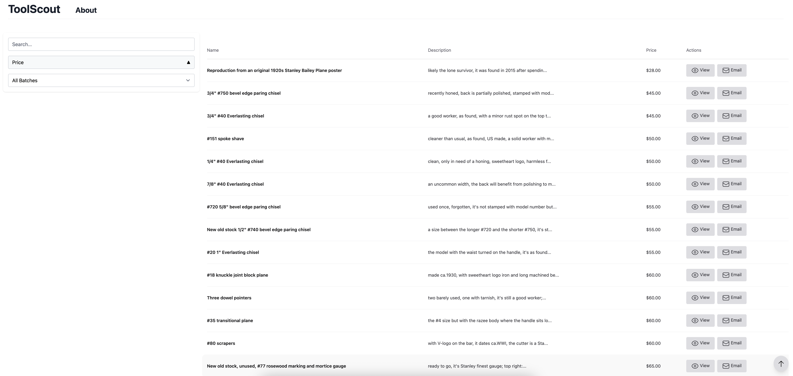
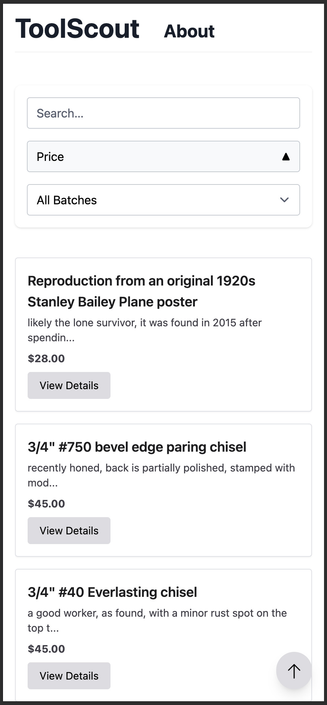

# Toolscout

Toolscout is web application developed in Phoenix. It exposes a single REST endpoint that's only accesible via API Key auth by a Google Apps Script that forwards an email containing an URL that leads to a raw HTML site that lists vintage woodworking tools for sale.

Toolscout processes this HTML and creates a LiveView of the listing with price sorting, search and batch sorting capabilities:

It's also designed to be responsive:

### Useful Commands

- `mix setup` - Install dependencies and set up the project
- `mix test` - Run tests
- `mix assets.deploy` - Compile assets for production
- `mix phx.gen.secret` - Generate a new secret key base

## Production

The app has been deployed at Fly.io [here](https://toolscout.fly.dev).

## Security

- Token authentication for API
- CSRF protection
- Password encryption with bcrypt
- Recommended SSL configuration for production

## Contributing

1. Fork the project
2. Create your feature branch (`git checkout -b feature/AmazingFeature`)
3. Commit your changes (`git commit -m 'Add some AmazingFeature'`)
4. Push to the branch (`git push origin feature/AmazingFeature`)
5. Open a Pull Request

## License

This project is licensed under the MIT License - see the [LICENSE](LICENSE) file for details.

## Resources

- [Phoenix Documentation](https://hexdocs.pm/phoenix)
- [Deployment Guides](https://hexdocs.pm/phoenix/deployment.html)
- [Elixir Forum](https://elixirforum.com/c/phoenix-forum)
